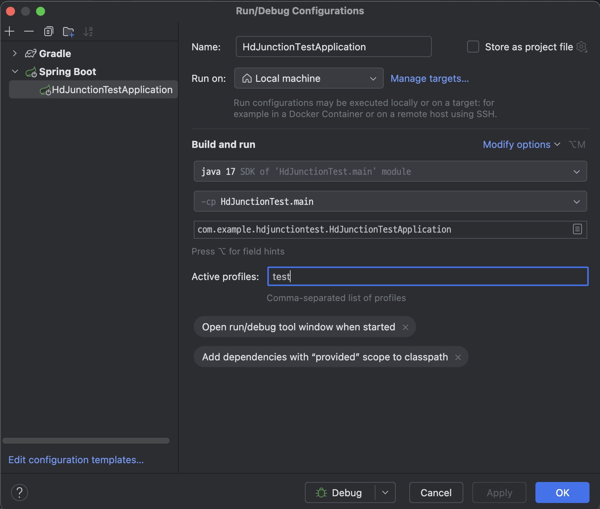

# Hd Junction 사전과제

## 개요

https://hdjunction.notion.site/2b1b494f9ad140668438f26c1de5379f
해당 기획서를 보고 병원 API를 작성했습니다.

## 환경

- 환경
  - Kotlin
  - Spring boot
  - JPA
- DB
  - H2
- 테스트 및 문서화
  - Swagger
  - Spring Rest Docs
- 기타
  - IntelliJ
  - kotlin-logging
  - Swagger
  
## DB Query

- H2

```sqlite
create table code (
                      code varchar(10) not null,
                      code_name varchar(10) not null,
                      code_group varchar(255) not null,
                      primary key (code)
);

create table code_group (
                            code_group_name varchar(10) not null,
                            description varchar(63) not null,
                            code_group varchar(255) not null,
                            primary key (code_group)
);

create table hospitals (
                           created_at timestamp(6) with time zone not null,
                           deleted_at timestamp(6) with time zone,
                           id bigint generated by default as identity,
                           updated_at timestamp(6) with time zone not null,
                           owner_name varchar(10) not null,
                           institution_code varchar(20) not null,
                           name varchar(45) not null,
                           primary key (id)
);

create table patients (
                          created_at timestamp(6) with time zone not null,
                          deleted_at timestamp(6) with time zone,
                          hospital_id bigint not null,
                          id bigint generated by default as identity,
                          updated_at timestamp(6) with time zone not null,
                          birth_day varchar(10) not null,
                          patient_code varchar(13) not null unique,
                          phone_number varchar(20) not null,
                          name varchar(45) not null,
                          gender_code varchar(10) not null,
                          primary key (id)
);

create table visits (
                        deleted_at timestamp(6) with time zone,
                        hospital_id bigint not null,
                        id bigint generated by default as identity,
                        patient_id bigint not null,
                        visited_date timestamp(6) with time zone not null,
                        medical_subject_code varchar(255) not null,
                        medical_type_code varchar(255) not null,
                        receipt_status_code varchar(255) not null,
                        primary key (id)
);


create index idx_code_group on code (code_group);

create index idx_hospitals_created_at on hospitals (created_at);
create index idx_hospitals_institution_code on hospitals (institution_code);

create index idx_patients_hospital_id on patients (hospital_id);
create index idx_patients_created_at on patients (created_at);
create index idx_patients_birth_day on patients (birth_day);
create index idx_patients_phone_number on patients (phone_number);


create index idx_visits_hospital_id on visits (hospital_id);
create index idx_visits_patient_id on visits (patient_id);
```


- Mysql

```sql
create table code(
                     code       varchar(10) primary key,
                     code_name  varchar(10)  not null,
                     code_group varchar(255) not null
) comment '코드' CHARACTER SET utf8mb4 COLLATE utf8mb4_unicode_ci;

create index idx_code_group on code (code_group);

create table code_group
(
    code_group_name varchar(10) primary key,
    description     varchar(63)  not null,
    code_group      varchar(255) not null
)  comment '코드 그룹' CHARACTER SET utf8mb4 COLLATE utf8mb4_unicode_ci;

create table hospitals
(
    id               BIGINT auto_increment primary key,
    name             varchar(45)                          not null,
    owner_name       varchar(10)                          not null,
    institution_code varchar(20)                          not null,
    created_at       datetime default current_timestamp() not null comment '등록 일시',
    updated_at       datetime default current_timestamp() not null on update current_timestamp() comment '수정 일시',
    deleted_at       datetime null default NULL comment '삭제 일시'
)  comment '병원' CHARACTER SET utf8mb4 COLLATE utf8mb4_unicode_ci;

create index idx_hospitals_created_at on hospitals (created_at);
create index idx_hospitals_institution_code on hospitals (institution_code);

create table patients
(
    id           BIGINT auto_increment primary key,
    hospital_id  bigint                               not null comment '병원 ID',
    name         varchar(45)                          not null comment '환자명',
    birth_day    varchar(10)                          not null comment '생년 월일',
    patient_code varchar(13)                          not null unique comment '환자 코드',
    phone_number varchar(20)                          not null comment '전화 번호',
    gender_code  varchar(10)                          not null comment '설별 코드',
    created_at   datetime default current_timestamp() not null comment '등록 일시',
    updated_at   datetime default current_timestamp() not null on update current_timestamp() comment '수정 일시',
    deleted_at   datetime null default NULL comment '삭제 일시'
)  comment '환자' CHARACTER SET utf8mb4 COLLATE utf8mb4_unicode_ci;

create index idx_patients_hospital_id on patients (hospital_id);
create index idx_patients_created_at on patients (created_at);
create index idx_patients_birth_day on patients (birth_day);
create index idx_patients_phone_number on patients (phone_number);

create table visits
(
    id                   BIGINT auto_increment primary key,
    hospital_id          bigint      not null comment '병원 ID',
    patient_id           bigint      not null comment '환자 ID',
    visited_date         datetime    not null comment '접수 일시',
    receipt_status_code  varchar(10) not null comment '접수 상태 코드',
    medical_subject_code varchar(10) not null comment '진료 과목 코드',
    medical_type_code    varchar(10) not null comment '진료 타입 코드',
    deleted_at           datetime null default NULL comment '삭제 일시'
)  comment '방문' CHARACTER SET utf8mb4 COLLATE utf8mb4_unicode_ci;

create index idx_visits_hospital_id on visits (hospital_id);
create index idx_visits_patient_id on visits (patient_id);
create index idx_visits_created_at on visits (created_at);

```


## 실행 환경




### 전체적인 처리 흐름

```
Controller ---- Application ------- Service ------- Repository
           Model                dto            entity
```

1. Service 를 Application과 Service로 분리 
   2. Application은 요청 데이터와 응답 데이터를 DTO로 가공해 Service와 Controller에 전달하는 역할 
   3. Service는 받은 데이터를 기반으로 비즈니스 로직을 처리하고 Repository와 처리합니다.
2. 각각 단계마다 순환 참조를 막기 위해 같은 레이어를 호출하지 않습니다. 
   3. 예를 들면 Application은 언제나 Service만을 호출하고, Service는 Repository를 호출한다. 반대로 Application에서 Application을 호출하는건 순환 참조의 문제가
        발생할 수 있으므로 자제한다.
3. Controller - Application 사이의 Dto와 Application - Service 사이의 Dto는 동일한 객체를 쓰지 않는다.
4. entity의 데이터를 수정할 일이 있으면 가급적이면 entity 하위의 메소드를 선언해서 사용한다. 
   5. entity의 데이터가 수정 될 때, 수정되는 부분을 추적하기 쉽게 하기 위한 방침

